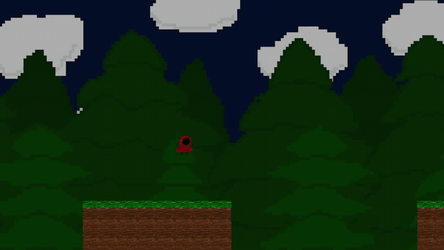

# Feraz

A 2D scrolling platformer built with Python and Pygame. Story, cutscenes, all art, and code is being worked on. 



[Watch the full-quality demo (MP4)](Assets/Demo/demo.mp4)

## Download

Grab `Feraz.exe` from the [latest release](https://github.com/Umarohh/Feraz-pygame/releases/latest) — no Python install needed (Windows only).

Windows SmartScreen may warn about an unsigned app the first time: click **More info → Run anyway**.

## Getting Started (from source)

### Requirements

- Python 3.10 or newer
- Pygame

```bash
pip install pygame
```

### Running the game

From the project root:

```bash
python main.py
```

The game launches borderless at 1280x720. Press **Escape** on the main menu to quit.

## Controls

| Action        | Keys                          |
| ------------- | ----------------------------- |
| Move          | `A` / `D` or `←` / `→`        |
| Jump          | `Space`, `W`, or `↑` (hold for a higher jump; double jump available) |
| Dash          | `X`                           |
| Sprint        | Hold `Left Shift`             |
| Pause         | `Esc`                         |
| Resume        | `Esc` (while paused)          |
| Quit to menu  | `Q` (while paused)            |
| Start / Menu  | `Enter`                       |

## Game Flow

1. Intro splash screens
2. Animated title screen (press `Enter` to start)
3. Cutscene 1 → Level 1 → Level 2 (final playable state) → Cutscene 2 (soon) → Level 3 (soon) → Cutscene 3 (soon)

You start with **3 lives**. Losing a life respawns you at the start of the current level; losing all three sends you to the Game Over screen.

## Project Structure

```
Feraz-Pygame2.0/
├── main.py                  # Entry point and main game loop
├── Scripts/
│   ├── game_state.py        # Main menu, in-game, pause, and game-over states
│   ├── scene_manager.py     # Orders levels and cutscenes; advances between them
│   ├── player.py            # Player movement, jumping, dashing, animation
│   ├── physics.py           # Gravity and collision base class
│   ├── camera.py            # Camera that follows the player within level bounds
│   └── tile.py              # Tile and Tilemap loading/rendering
├── Scenes/
│   ├── Levels/
│   │   ├── level_dependancies.py   # Shared Level base class
│   │   ├── level_1.py
│   │   ├── level_2.py
│   │   └── level_3.py
│   └── Cutscenes/
│       ├── cutscene_1.py
│       ├── cutscene_2.py
│       └── cutscene_3.py
└── Assets/
    ├── Universal/           # Player animations, tiles, UI (title screen frames)
    ├── Levels/              # Per-level tilemaps (.txt) and parallax backgrounds
    └── Cutscenes/           # Cutscene images
```

## How It Works

- **`GameStateManager`** switches between high-level states (main menu, in game, paused, game over). Each state handles its own input, logic, and drawing.
- **`SceneManager`** holds the ordered list of levels and cutscenes. When the current scene sets `completed = True`, it advances to the next one.
- **`Level`** (the base class) loads a tilemap from a `.txt` file, loads parallax background layers, and handles player/camera updates. Each concrete level only defines its backgrounds and its completion condition.
- **`Cutscenes`** are simple timed scenes that display an image and then mark themselves complete.

## Adding a Level

1. Create `Assets/Levels/LevelN/Map/<name>.txt` for the tilemap and put background PNGs in `Assets/Levels/LevelN/Background/`.
2. Create `Scenes/Levels/level_N.py` with a class that subclasses `Level`, calls `load_backgrounds(...)`, and overrides `check_completion_condition()`.
3. Add an instance of the new class to the `scenes` list in `Scripts/scene_manager.py` at the position you want it to play.

## Credits

- Developed by Umar Ahmad

## Technologies

- Python 3.10+, Pygame 
- Pygame
- Object-oriented programming
- Tilemap-based level design
- 2D collision detection
- Smooth follow camera class
- Overall State and scene management
- Parallax background loading
- Animation system based on player state

## FUTURE

- refactor/modularize code from player.py, create an animator controller, player controller, input file
- refactor/modularize game state code, make main menu, pause files, etc
- add a soundtrack, sound effects
- add obstacles, enemies, basic combat, 
- add a timer, health system, ranking system. 
- finish opening cutscene, create end cutscene
- iterate over base game art, animations, sprites, backgrounds
